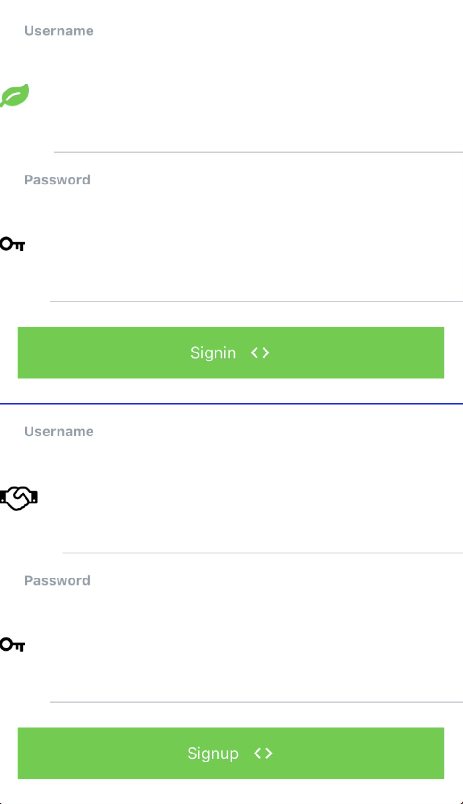
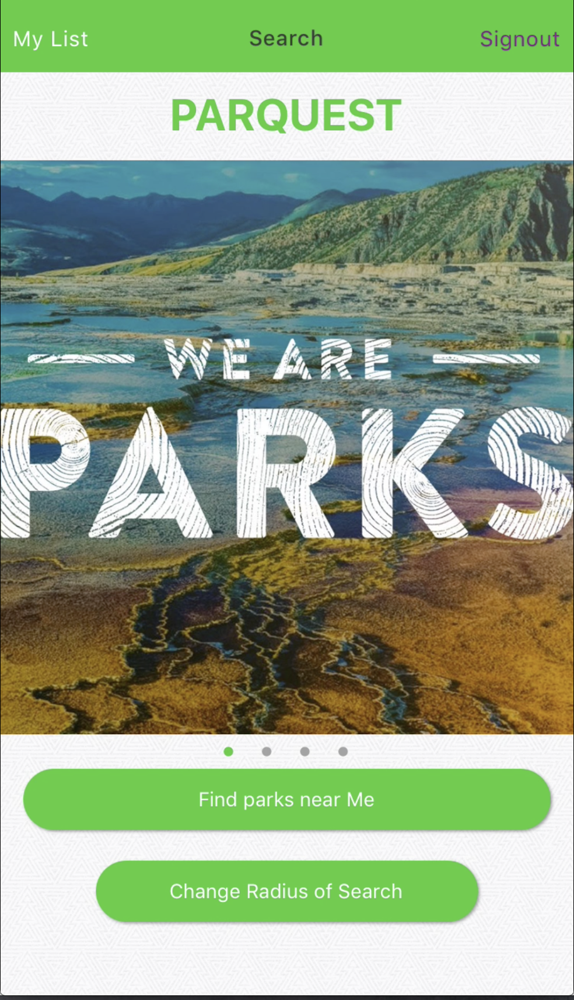
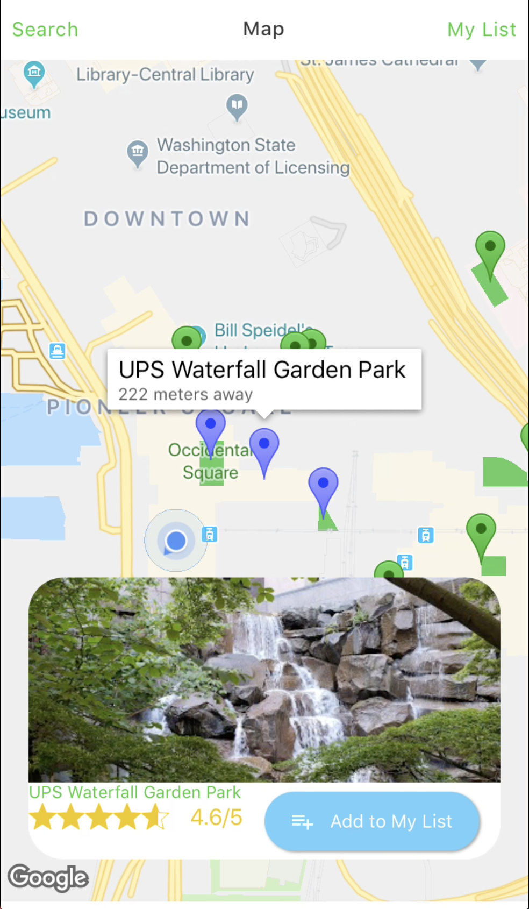
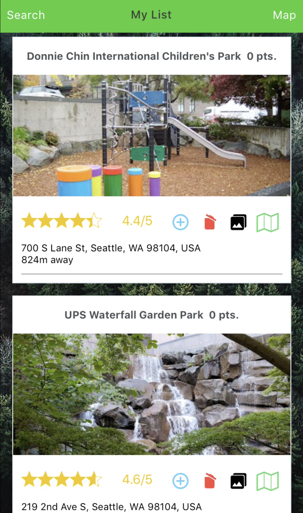
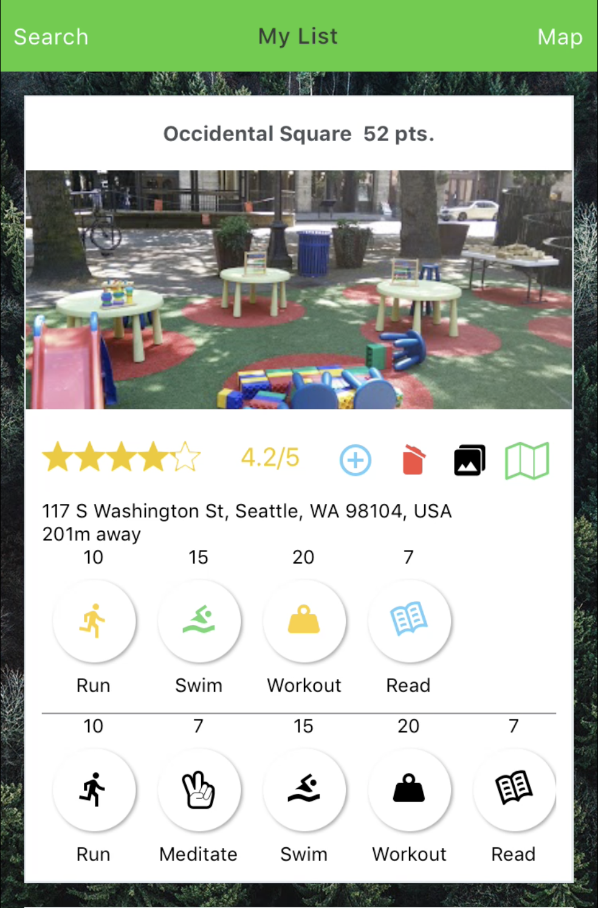

ParQuest
========
##### Capstone
ParQuest is an app that connects users to the parks around them and motivates them
to get outside more through personalization, activities and photos. ParQuest utilizes
the Google Places Api to provide up-to-date, accurate data from parks around the world.

#### ////SOON TO BE ON THE APP STORE////
### Installation

* ` npm install `
* Get Api Key from
[Google Places Api](https://developers.google.com/places/web-service/get-api-key)
* ` touch env.json `
* Inside env.json create json object with key 'API_KEY' and value of Api Keyboard
* Download the Expo Client at
[Expo Docs](https://docs.expo.io/versions/latest/)
* Open app in Expo XDE

### ScreenShots
###### When a user searches with a radius that has more than 20 Parks in it they can tap 'More Parks' to access Google Places again with a token from the first search to receive further parks
| 1st Search                               | 2nd Search                               | 3rd Search                              |
| ---------------------------------------- |:----------------------------------------:| ---------------------------------------:|
|  |  | |

| Authorization                            | Landing Page                             | Tapping on Map Markers shows carousel whose items have rating and photo|
| ---------------------------------------- |:----------------------------------------:| ---------------------------------------:|
|            |   | 

| Personalization comes in My List         | Each Park in My List has activities and photos the user has done at that park      |
| ---------------------------------------- |:----------------------------------------:|
|          ||
[Backend Github](https://github.com/abedababe8/awesome-project-back)
