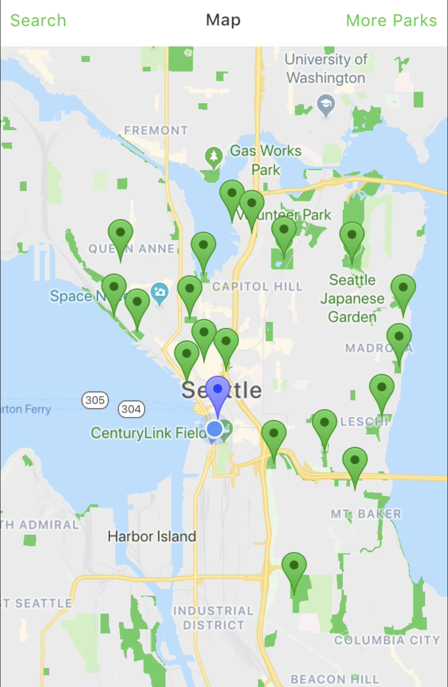
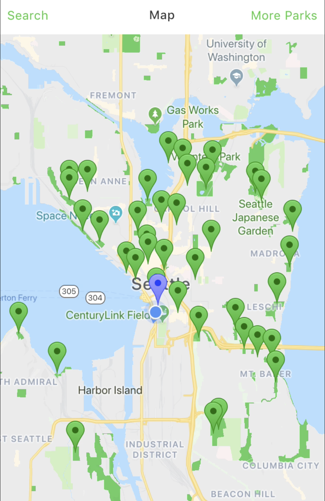
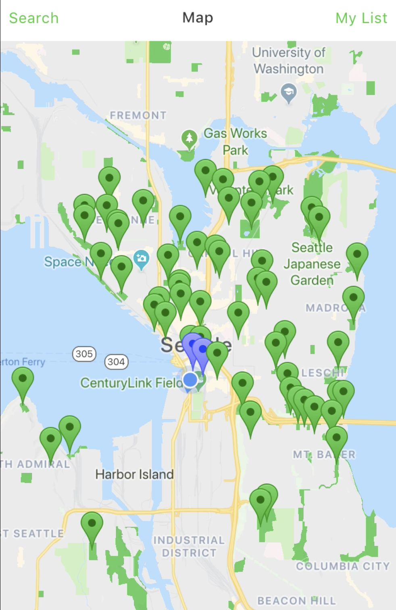

ParQuest
========
ParQuest is an app that connects users to the parks around them and motivates them
to get outside more through personalization, activities and photos. ParQuest utilizes
the Google Places Api to provide up-to-date, accurate data from parks around the world.

### Installation

* ` npm install `
* Get Api Key from
[Google Places Api](https://developers.google.com/places/web-service/get-api-key)
* ` touch env.json `
* Inside env.json create json object with key 'API_KEY' and value of Api Keyboard
* Download the Expo Client at
[Expo Docs](https://docs.expo.io/versions/latest/)
* Open app in Expo XDE

### ScreenShots

| 1st Search    | 2nd Search    | 3rd Search  |
| ------------- |:-------------:| -----------:|
|  |  | 

[Backend Github](https://github.com/abedababe8/awesome-project-back)
